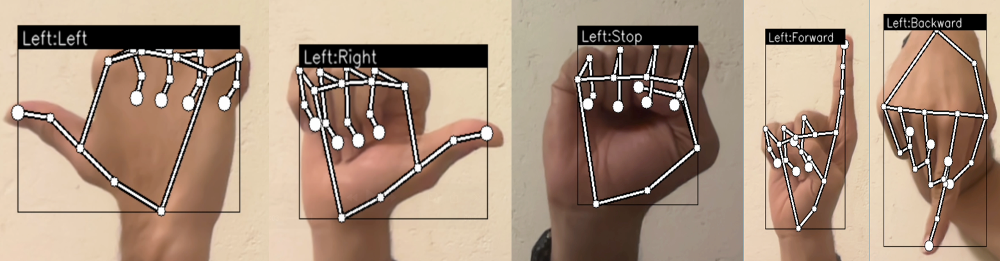
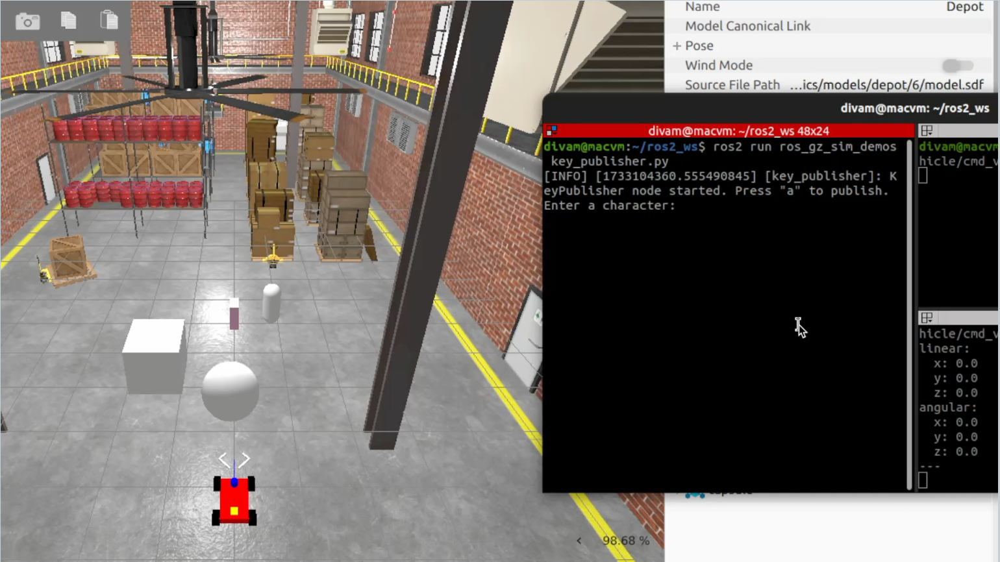

# Gestura
A gesture controlled robot simulated in gazebo with ROS2

## Implementation
For Simulation perform colcon build and then 

```
ros2 launch gestura_simulation own.launch.py
```

For teleop, In another terminal run

```
ros2 run gestura_simulation key_publisher
```

For Getsure based control, run

```
ros2 run Gesture_Control_Node robot_control
```

Follow the instructions to control the robot


## Results

<p> A simple robot designed for minimal functionality </p>


<p> Hand Gesture control for opening and closing the gripper</p>
<p float="left">
 
 
</p>

<p> Hand gestures for controlling the direction of travel of the robot </p>
 

<p> Output window in gazebo simulation </p>
 

## Presentation
Please find the presenatation slides at - [LinkToPPT]([url](https://docs.google.com/presentation/d/1pCbqbvdjksIjxzxnlgdSUfcdxTCjkJdb/edit?usp=sharing&ouid=115122328361930346605&rtpof=true&sd=true))

## Acknowledgements
This project was done by Divam Trivedi as a part of final project presentation for RBE 526 - Human-Robot Interaction by Prof. Jane Li at WPI.
