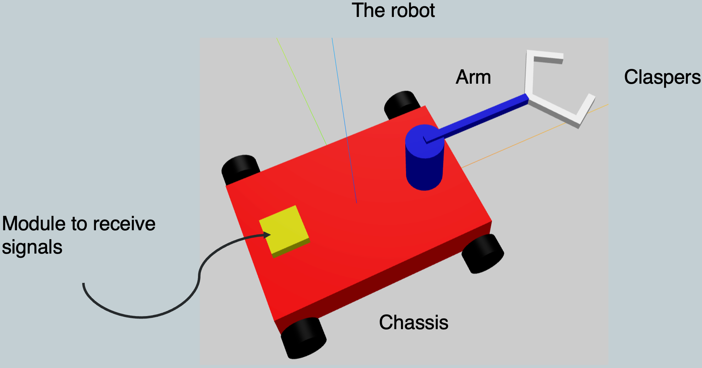
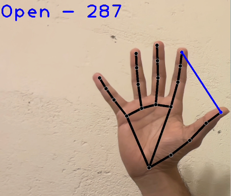
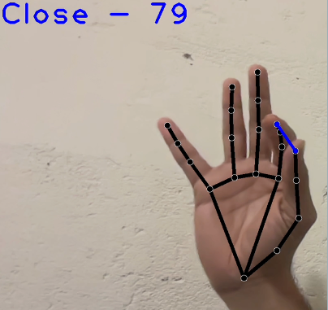

# Gestura
A gesture controlled robot simulated in gazebo with ROS2

For Simulation perform colcon build and then 

```
ros2 launch gestura_simulation own.launch.py
```

For teleop, In another terminal run

```
ros2 run gestura_simulation key_publisher
```

For Getsure based control, run

```
ros2 run Gesture_Control_Node robot_control
```

Follow the instructions to control the robot


### Results

<p> A simple robot designed for minimal functionality </p>


<p> Hand Gesture control for opening and closing the gripper</p>
<p float="left">
 
 
</p>
